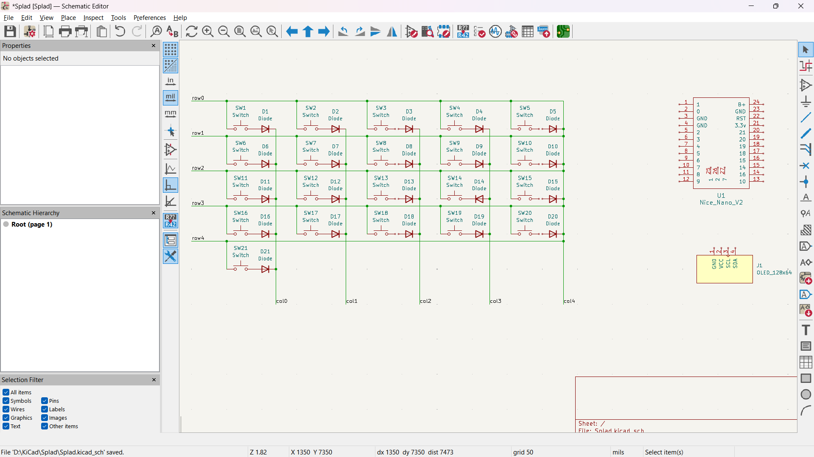
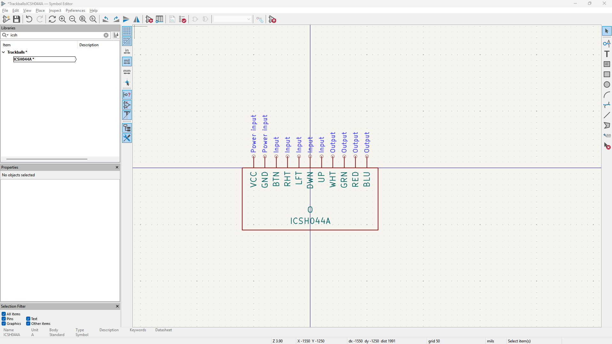
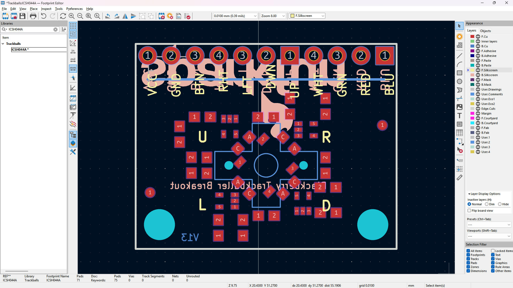
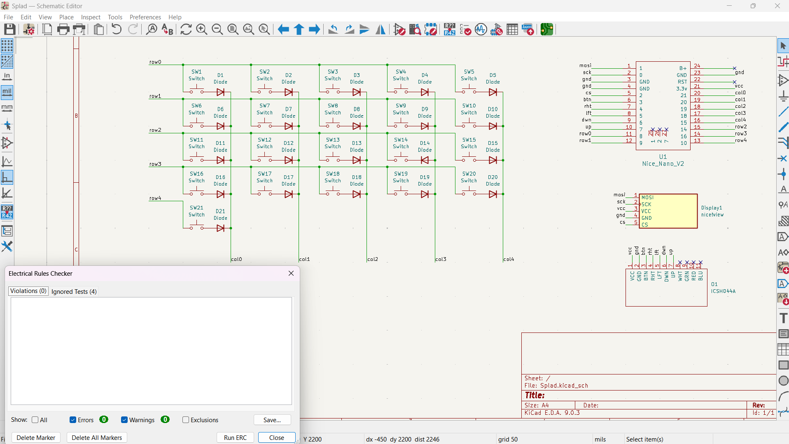
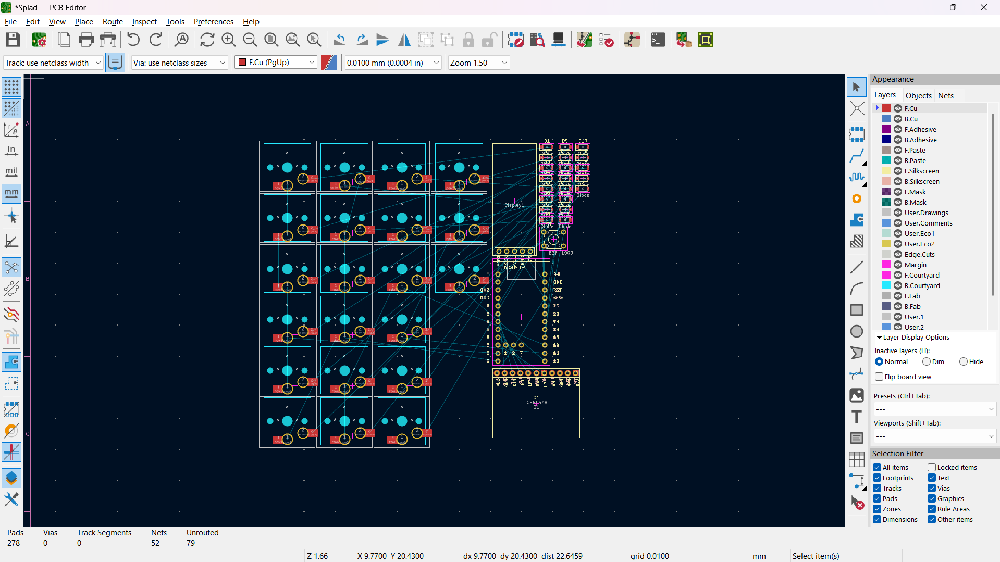
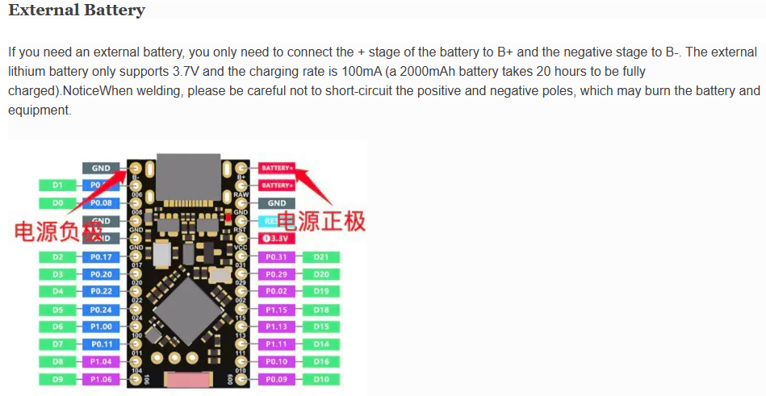
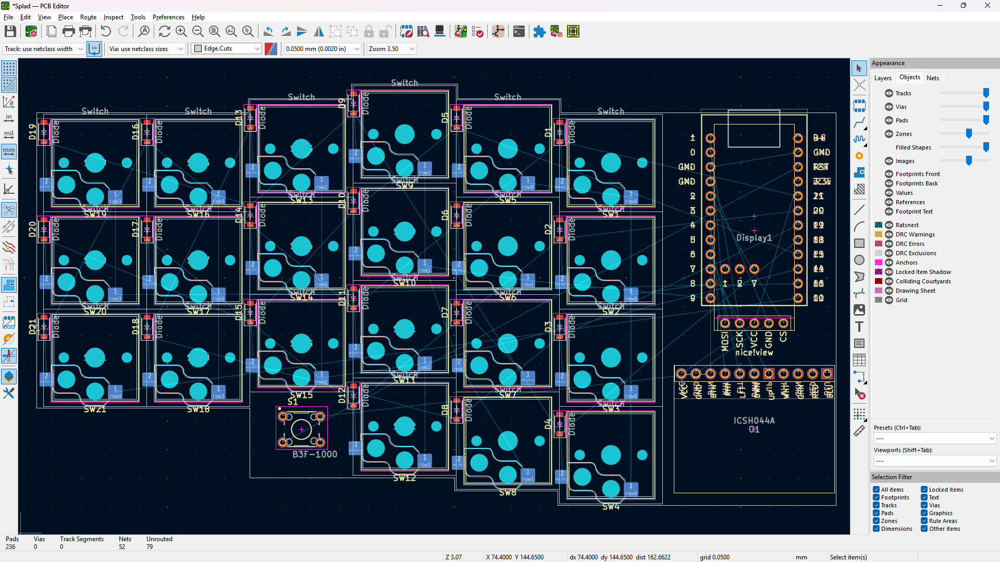
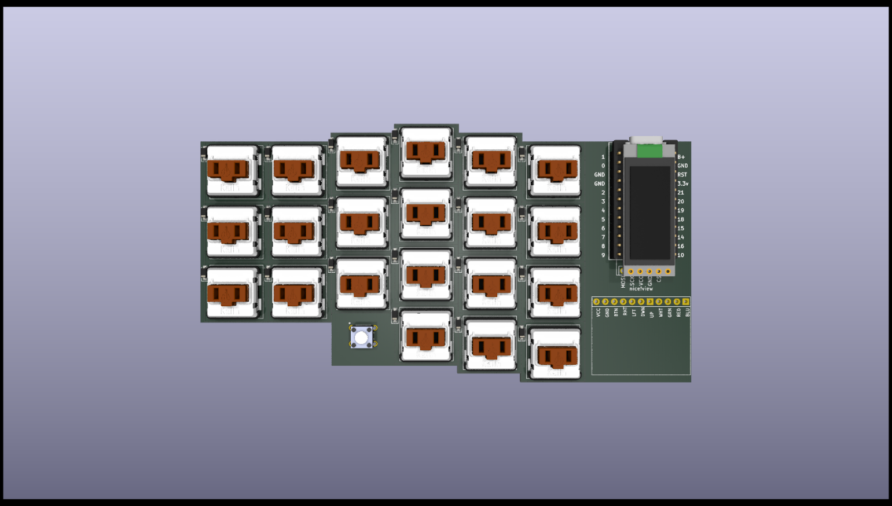

# Journal

- [Journal](#journal)
  - [21/07/2025](#21072025)
  - [22/07/2025](#22072025)
  - [23/07/2025](#23072025)

> [!NOTE]\
> Total time spent: **17h**

## 21/07/2025

Researching components, I'll probably go with the Raspberry Pi Pico 2WH.

> [!NOTE]\
> Total time spent: **2h**

## 22/07/2025

Nice OLED - https://www.aliexpress.com/item/1005005906852549.html
Trackball Breakout - https://shop.pimoroni.com/products/trackball-breakout?variant=27672765038675

Ok so on each side:
* 5 columns on the main part, staggered. In 3 rows, to make the main section.
* An extra column on the outer side (for extra stuff - the alphabet will cover the main part).
* Then a few keys underneath and out towards the screen for thumb modifiers etc (shift, other layers, etc).

Did a reddit post: https://www.reddit.com/r/KeyboardLayouts/comments/1m6a7mj/layouts_for_those_without_a_left_ring_finger/

Ok so each side will have 18 keys + 3 modifier keys = 21 keys, 42 in total. Thats a 5x5 matrix so 10 GPIO pins needed.

I have decided to use the Raspberry Pi Pico 2 W.

Nevermind, its later and back to the nice! nano v2 as it has LiPo charging built in, a USB C port, Bluetooth, etc.

Going to use this display: https://www.aliexpress.com/item/1005006141235306.html
And this trackball (I will have to create a schematic etc for it ;-;): https://www.aliexpress.com/item/1005009386877838.html

Set up a basic key matrix:

> [!NOTE]\
> Total time spent: **5h**

## 23/07/2025

Finished symbol (I numbered them after dw lol):

I have decided not to wire to the lighting pins because I don't want the trackball to light up.

Found this Sparkfun one which has Eagle files I'll convert into KiCad for the footprint: https://github.com/sparkfun/Blackberry_Trackballer_Breakout/blob/master/Hardware/SparkFun_Blackberry_Trackballer_Breakout.sch. Its got the same pins just slightly different dimensions

Pretty sure this is good - I had to change a bunch of dimensions and stuff but it's fine, and also swap the labelling of the pins:

I have decided to use the nice! view (or compatible from AliExpress) due to a MUCH longer battery life (it reflects light, OLEDs emit it - source, Reddit, the best source ofc). Srs tho Reddit is so useful.

Finished the schematic (special mention to the Electrical Rules Checker which saved me a lot of heartaches later down lol):

I have decided to add a button to RST as well.

Started by importing stuff into the PCB editor.

Useful for column stagger: https://flatfootfox.com/ergogen-part1-units-points/

Useful thing I found about connecting a battery:

0.25mm for outside line

Not done routing yet but main shape done:

For now I'll work on the case as I might have to move components depending on how the case goes which would mean rerouting if I route now.

> [!NOTE]\
> Total time spent: **10h**