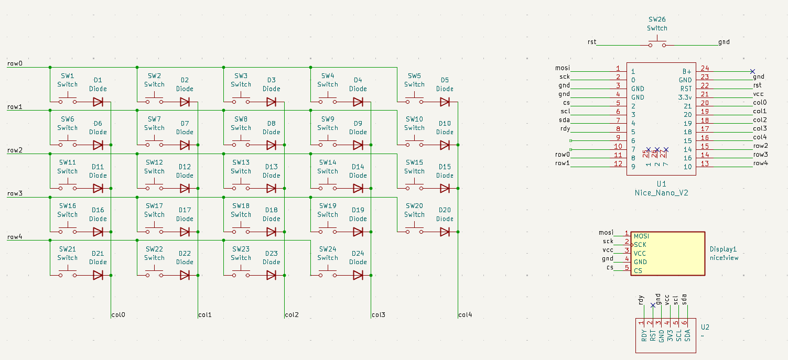
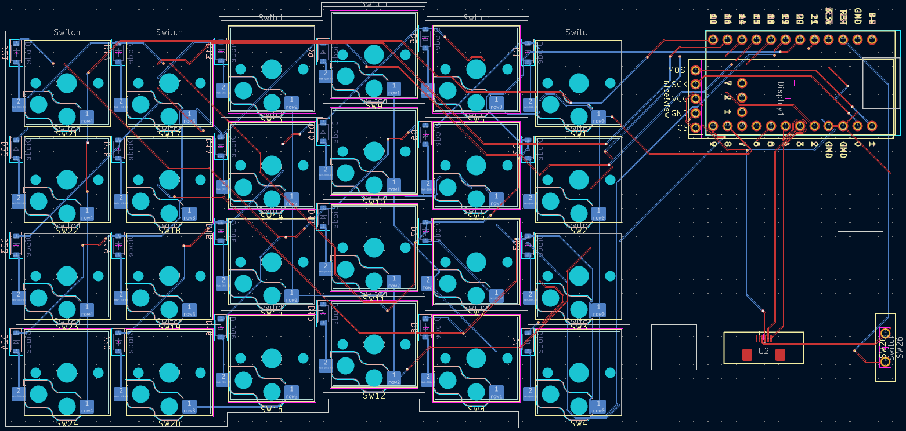
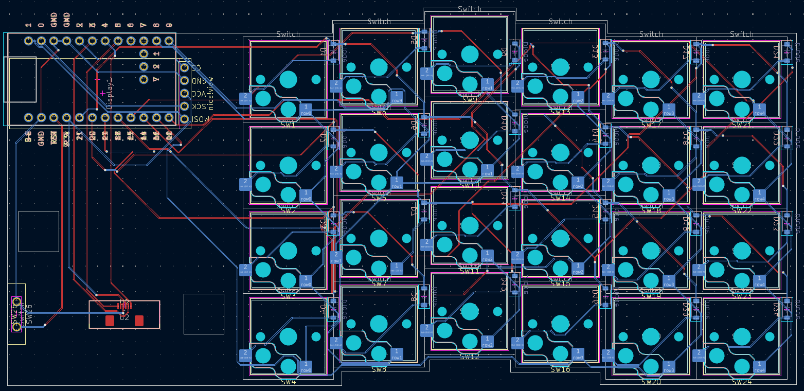

# Splad

- [Splad](#splad)
  - [Project Structure](#project-structure)
  - [Journal](#journal)
  - [PCB](#pcb)
    - [Schematic](#schematic)
    - [PCB Design \[Left\]](#pcb-design-left)
    - [PCB Design \[Right\]](#pcb-design-right)
  - [BOM](#bom)
  - [Software](#software)

| Cover                            | Exploded View (ish)                              |
| -------------------------------- | ------------------------------------------------ |
|  |  |

A 48 key split ergonomic keyboard, with a screen and trackpad, created only using KiCad and Fusion 360 (no fancy tools like Ergogen, etc teeheehee - except for rending in Blender of course). The case is again in two sections, which join together via 8 magnets.

I made this project because my current keyboard is too loud for my workspace, and as well as that I wanted to try a new keyboard layout in my longer holiday post-GCSEs, so I decided to also design a split keyboard to more easily accomodate the new layout. As well as this, it is much more compact as I don't need to carry a separate keyboard and mouse. Even though my current keyboard is a membrane one its still noisy, especially because the keycaps slide against the case when moving down - something I prevented in my design, to reduce the noise.

## Project Structure

> [!IMPORTANT]\
> Only includes files / folders relevant to admin that would benefit from explanation.

```
└── 📁hackpad
    └── 📁production
        └── ... # Contains all Gerber ZIPs, case `.step` files, and also the .f3z project from Fusion 360 itself. The `plate-left.dxf` is the only DXF for the plate, as it was mirrored in KiCad, for the `plate-right.zip` - saves time.
    └── 📁firmware
        ├── ... # Contains the ZMK firmware
    ├── JOURNAL.md # The journal of the design process
    └── README.md # This file
```

## Journal

The [journal](JOURNAL.md) contains each day's work, logged, with the aid of images. Total time is at the top and each day has its time logged. There is also a Table of Contents for easy navigation :).

> [!WARNING]\
> Its unfinished, DM in the Slack if you're not Cyao to explain why - if you're Cyao you know why.

> [!NOTE]\
> Total time spent: **43h**

## PCB

Fully checked with DRC / ERC - no errors.

### Schematic



### PCB Design [Left]



### PCB Design [Right]



## BOM

$192.54

<details closed>
<summary>Click to open</summary>

| Component                    | Description          | Notes                                                                                              | Quantity | Self Bought? | Price       | Shipping             | Provider   | Link                                                                                  |
| ---------------------------- | -------------------- | -------------------------------------------------------------------------------------------------- | -------- | ------------ | ----------- | -------------------- | ---------- | ------------------------------------------------------------------------------------- |
| Headers                      |                      | For screen because it doesnt specify coming with some and I am taking zilch chances                | 1        |              | £1.14       |                      | AliExpress | [Link](https://www.aliexpress.com/item/4000988113226.html?...)                        |
| JST PH 2.00mm                | PH 2.00mm            | To connect the buttons to the PCB                                                                  | 1        |              | £2.25       |                      |            | [Link](https://www.aliexpress.com/item/1005007691949301.html?...)                     |
| Momentary Push Button        | Red 5PCS             | The actual button                                                                                  | 1        |              | £3.23       |                      |            | [Link](https://www.aliexpress.com/item/1005008498887267.html?...)                     |
| Heat Shrink Tube             | 164pcs / Mixed size  | To cover around the joint for the switch to power on / off the board                               | 1        | Yes          | £1.28       |                      |            | [Link](https://www.aliexpress.com/item/1005008146302901.html?...)                     |
| Slide Switch                 | k014a004-G3          | Switching it up here, eh? Lol ok thats enough bad jokes for a day ;-;. To switch on/off the board. | 1        | Yes          | £0.77       |                      |            | [Link](https://www.aliexpress.com/item/1005008904067609.html?...)                     |
| nice!nano v2                 | But cheaaaper        | We luv AliExpress                                                                                  | 2        |              | £3.00       |                      |            | [Link](https://www.aliexpress.com/item/1005007383270623.html?...)                     |
| nice!view                    | But cheapy           | Compatible screen (without headers)                                                                | 2        |              | £22.69      |                      |            | [Link](https://www.aliexpress.com/item/1005008115497843.html?...)                     |
| Micro JST                    | Male 5 Pcs 100mm     | https://learn.adafruit.com/on-slash-off-switches/overview                                          | 1        |              | £0.32       | £2.03                |            | [Link](https://www.aliexpress.com/item/1005008864177105.html?...)                     |
| Micro JST                    | Female 5 Pcs 100mm   | https://learn.adafruit.com/on-slash-off-switches/overview                                          | 1        |              | £0.48       | £2.03                |            | [Link](https://www.aliexpress.com/item/1005008864177105.html?...)                     |
| Push Button                  | 6x6x6mm              | For the reset function                                                                             | 1        |              | £0.74       | £2.24                |            | [Link](https://www.aliexpress.com/item/4001224103835.html?...)                        |
| "Supah Powerful" Disc Magnet | 4x3mm 50PCS          | To hold the case together                                                                          | 1        | Yes          | £2.27       |                      |            | [Link](https://www.aliexpress.com/item/1005009094333864.html?...)                     |
| Choc Keycaps v1              | 50 White Transparent |                                                                                                    | 1        |              | £21.99      |                      |            | [Link](https://www.aliexpress.com/item/1005009094333864.html?...)                     |
| 1N4148W SOD-123 Diodes       | 100pcs               |                                                                                                    | 1        |              | £0.89       |                      |            | [Link](https://www.aliexpress.com/item/4000685043735.html?...)                        |
| Self Adhesive Rubber Bumpers | 100pcs 5mmx2mm       | For PCB and bottom of the case                                                                     | 1        | Yes          | £1.69       |                      |            | [Link](https://www.aliexpress.com/item/1005004068119765.html?...)                     |
| Kalih Hot Swap Socket        | 50pcs                | For switches                                                                                       | 1        |              | £4.89       |                      |            | [Link](https://www.aliexpress.com/item/1005003575767699.html?...)                     |
| FPC Connector                | 6p/10pcs             | To solder to the PCB, to connect to the TPS43                                                      | 1        |              | £0.74       |                      |            | [Link](https://www.aliexpress.com/item/1005009196851411.html?...)                     |
| FPC Ribbon                   |                      | The actual ribbon to connect to the TPS43                                                          | 2        |              | £3.02       |                      |            | [Link](https://www.aliexpress.com/item/1005007078121242.html?...)                     |
| Kailh Choc Switches          | Pink 50pcs           | Quitest ones I can find that aren't atrociously priced lol                                         | 1        |              | £18.39      |                      |            | [Link](https://www.aliexpress.com/item/1005008883418065.html?...)                     |
| **Total (AliExpress)**       |                      |                                                                                                    |          |              | **£82.36**  | Included on ze left! |            |                                                                                       |
|                              |                      |                                                                                                    |          |              |             |                      |            |                                                                                       |
| 150mAh 3.7V LiPo Battery     |                      | No batteries on AliExpress that didn’t ship in September                                           | 2        |              | £9.00       | £3.90                | PiHut      | [Link](https://thepihut.com/products/150mah-3-7v-lipo-battery?variant=42388690993347) |
| **Total (PiHut)**            |                      |                                                                                                    |          |              | **£12.90**  |                      |            |                                                                                       |
|                              |                      |                                                                                                    |          |              |             |                      |            |                                                                                       |
| TPS43                        |                      | Trackpad                                                                                           | 2        |              | £7.90       | £12.00               |            |                                                                                       |
| **Total (Mouser)**           |                      |                                                                                                    |          |              | **£19.90**  |                      |            |                                                                                       |
|                              |                      |                                                                                                    |          |              |             |                      |            |                                                                                       |
| PCB Left                     |                      |                                                                                                    | 1        |              | £6.42       | £7.34                | JLCPCB     |                                                                                       |
| PCB Right                    |                      |                                                                                                    | 1        |              | £6.42       |                      |            |                                                                                       |
| Plate Left                   |                      |                                                                                                    | 1        |              | £5.44       |                      |            |                                                                                       |
| Plate Right                  |                      |                                                                                                    | 1        |              | £5.44       |                      |            |                                                                                       |
| **Total (PCBs & Plates)**    |                      |                                                                                                    |          |              | **£31.07**  | Included on ze left! |            |                                                                                       |
|                              |                      |                                                                                                    |          |              |             |                      |            |                                                                                       |
| **TOTAL**                    |                      |                                                                                                    |          |              | **£146.23** |                      |            |                                                                                       |


</details>

## Software

Will be _mostly_ added once the physical components are received and assembled, as I don't want to start writing code and then find out it doesn't work because I accidentally used libraries for different components, or something similar to that.

I have added some code in the [`/firmware`](firmware) directory though.

---
<sub>Thanks to [Hackclub](https://hackclub.com) for such an amazing opportunity - this project was made by [@skifli](https://github.com/skifli) with 🩷, under the [MIT License](LICENSE).</sub>