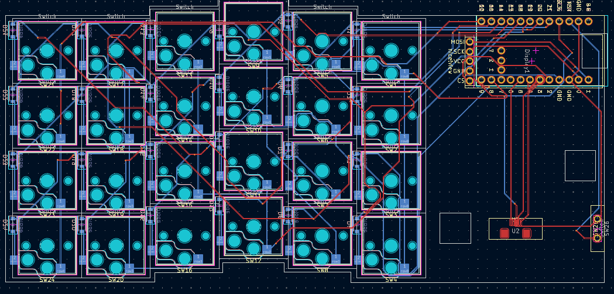

# Splad

- [Splad](#splad)
  - [Project Structure](#project-structure)
  - [Journal](#journal)
  - [PCB](#pcb)
    - [Schematic](#schematic)
    - [PCB Design](#pcb-design)
  - [BOM](#bom)
  - [Software](#software)

| Cover                            | Exploded View                                    |
| -------------------------------- | ------------------------------------------------ |
|  |  |

A 48 key split ergonomic keyboard, with a screen and trackpad, created only using KiCad and Fusion 360 (no fancy tools like Ergogen, etc teeheehee - except for rending in Blender of course). The case is again in two sections, which join together via 8 magnets.

I made this project because my current keyboard is too loud for my workspace, and as well as that I wanted to try a new keyboard layout in my longer holiday post-GCSEs, so I decided to also design a split keyboard to more easily accomodate the new layout. As well as this, it is much more compact as I don't need to carry a separate keyboard and mouse.

## Project Structure

> [!IMPORTANT]\
> Only includes files / folders relevant to admin that would benefit from explanation.

```
└── 📁hackpad
    └── 📁design
        └── 📁cad
            ├── ... # Contains the KiCad directory for the left and right CAD
        └── 📁pcb-left
            ├── ... # Contains the KiCad directory for the left PCB
        └── 📁pcb-right
            ├── ... # Contains the KiCad directory for the right PCB
        └── 📁plate
            ├── ... # Contains the KiCad directory for the left and right plate, which is made from an exported DXF from the Fusion 360 Sketch (plate.dxf)
    ├── JOURNAL.md # The journal of the design process
    └── README.md # This file
```

## Journal

The [journal](JOURNAL.md) contains each day's work, logged, with the aid of images. Total time is at the top and each day has its time logged. There is also a Table of Contents for easy navigation :).

> [!WARNING]\
> Its unfinished, DM in the Slack if you're not Cyao to explain why - if you're Cyao you know why.

> [!NOTE]\
> Total time spent: **43h**

## PCB

### Schematic


### PCB Design



## BOM

$257.35 in USD.

<details closed>
<summary>Click to open</summary>

| Component              | Description          | Notes                                                                               | Quantity | Price      | Shipping             | Provider   | Link                                                                                                                                                                                                                                                      |
| ---------------------- | -------------------- | ----------------------------------------------------------------------------------- | -------- | ---------- | -------------------- | ---------- | --------------------------------------------------------------------------------------------------------------------------------------------------------------------------------------------------------------------------------------------------------- |
| Headers                |                      | For screen because it doesnt specify coming with some and I am taking zilch chances | 1        | £1.08      |                      | AliExpress | [Link](https://www.aliexpress.com/item/4000988113226.html?spm=a2g0o.cart.0.0.2f3538daCbb432&mp=1&pdp_npi=5%40dis%21GBP%21GBP%201.08%21GBP%201.08%21%21GBP%201.08%21%21%21%40210385bb17539668072041969ef01d%2110000013202368850%21ct%21UK%21-1%21%211%210) |
| JST PH 2.00mm          | PH 2.00mm            | To connect the buttons to the PCB                                                   | 1        | £2.25      |                      |            | [Link](https://www.aliexpress.com/item/1005007691949301.html)                                                                                                                                                                                             |
| Momentary Push Button  | Red 5PCS             | The actual button                                                                   | 1        | £3.23      |                      |            | [Link](https://www.aliexpress.com/item/1005008498887267.html)                                                                                                                                                                                             |
| Heat Shrink Tube       | Mixed size           | Heat around the joint for the button to the switch                                  | 1        | £1.35      |                      |            | [Link](https://www.aliexpress.com/item/1005008146302901.html)                                                                                                                                                                                             |
| Slide Switch           | k014a004-G3          | "Switching it up here, eh? Lol ok thats enough bad jokes for a day ;-;"             | 1        | £2.09      |                      |            | [Link](https://www.aliexpress.com/item/1005008904067609.html)                                                                                                                                                                                             |
| Nice nano              | But cheaaaper        | Teeheehee                                                                           | 1        | £2.21      |                      |            | [Link](https://www.aliexpress.com/item/1005007383270623.html)                                                                                                                                                                                             |
| nice!view              |                      | Compatible screen (without headers)                                                 | 1        | £22.69     | –                    | AliExpress | [Link](https://www.aliexpress.com/item/1005008115497843.html)                                                                                                                                                                                             |
| Micro JST              | Male 5 Pcs 100mm     | [Adafruit Ref](https://learn.adafruit.com/on-slash-off-switches/overview)           | 1        | £0.50      | £1.97                |            | [Link](https://www.aliexpress.com/item/1005008864177105.html)                                                                                                                                                                                             |
| Micro JST              | Male 5 Pcs 100mm     | [Adafruit Ref](https://learn.adafruit.com/on-slash-off-switches/overview)           | 1        | £0.34      | £1.97                |            | [Link](https://www.aliexpress.com/item/1005008864177105.html)                                                                                                                                                                                             |
| Push Button            | 6x6x6mm              | For the reset function                                                              | 1        | £0.74      | £2.16                |            | [Link](https://www.aliexpress.com/item/4001224103835.html)                                                                                                                                                                                                |
| Disc Magnet            | 50PCS                | To hold the case together                                                           | 1        | £5.44      |                      |            | [Link](https://www.aliexpress.com/item/1005008963202728.html)                                                                                                                                                                                             |
| Keycaps                | 50 White Transparent |                                                                                     | 1        | £23.89     |                      |            | [Link](https://www.aliexpress.com/item/1005006734545486.html)                                                                                                                                                                                             |
| Diodes                 | 100pcs               |                                                                                     | 1        | £1.12      |                      |            | [Link](https://www.aliexpress.com/item/4000685043735.html)                                                                                                                                                                                                |
| Rubber Bumpers         | 5mmx2mm              | For PCB and bottom of the case                                                      | 1        | £1.69      |                      |            | [Link](https://www.aliexpress.com/item/1005004068119765.html)                                                                                                                                                                                             |
| Hot Swap Socket        | 50pcs                | For switches                                                                        | 1        | £5.23      |                      |            | [Link](https://www.aliexpress.com/item/1005003575767699.html)                                                                                                                                                                                             |
| FPC Connector          | 6p 10pcs             | For TPS43                                                                           | 1        | £0.76      |                      |            | [Link](https://www.aliexpress.com/item/1005009196851411.html)                                                                                                                                                                                             |
| FPC Ribbon             |                      | For TPS43                                                                           | 1        | £4.53      |                      |            | [Link](https://www.aliexpress.com/item/1005007078121242.html)                                                                                                                                                                                             |
| **Total (AliExpress)** |                      |                                                                                     |          | **£85.24** | Included on ze left! |            |                                                                                                                                                                                                                                                           |
| 150mAh 3.7V Battery    |                      | "No batteries on AliExpress that didn't ship in Sept ;-;"                           | 1        | £4.50      | £3.90                | PiHut      | [Link](https://thepihut.com/products/150mah-3-7v-lipo-battery?variant=42388690993347)                                                                                                                                                                     |
| **Total (PiHut)**      |                      |                                                                                     |          | **£8.40**  |                      |            |                                                                                                                                                                                                                                                           |
| TPS43                  |                      | Trackpad                                                                            | 2        | £7.90      | £12                  |            |                                                                                                                                                                                                                                                           |
| **Total (Mouser)**     |                      |                                                                                     |          | **£19.90** |                      |            |                                                                                                                                                                                                                                                           |
| Choc switches          |                      | lowprokv                                                                            | 5        | £47.50     | £5.28                |            | [Link](https://mechboards.co.uk/products/lowprokb-ambients-silent-linear-nocturnal-choc-v1?variant=47588169908429)                                                                                                                                        |
| **Total (Mechboards)** |                      |                                                                                     |          | **£52.78** | Included on ze left! |            |                                                                                                                                                                                                                                                           |
| PCB                    |                      |                                                                                     | 2        | £13.56     | £4.17                | JLCPCB     |                                                                                                                                                                                                                                                           |
| Plate                  |                      |                                                                                     | 2        | £10.86     |                      |            |                                                                                                                                                                                                                                                           |
|                        |                      |                                                                                     |          | **£28.59** | Included on ze left! |            |                                                                                                                                                                                                                                                           |
|                        |                      |                                                                                     |          | **TOTAL**  | **£194.91**          |            |                                                                                                                                                                                                                                                           |
</details>

## Software

Will be _mostly_ added once the physical components are received and assembled, as I don't want to start writing code and then find out it doesn't work because I accidentally used libraries for different components, or something similar to that.

I have added some code in the [`/firmware`](firmware) directory though.

---
<sub>Thanks to [Hackclub](https://hackclub.com) for such an amazing opportunity - this project was made by [@skifli](https://github.com/skifli) with 🩷, under the [MIT License](LICENSE).</sub>