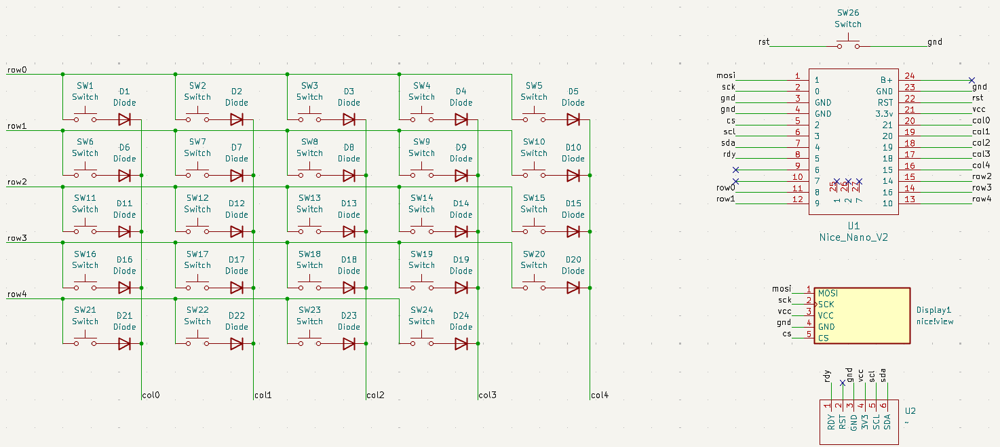

# Splad

- [Splad](#splad)
  - [Project Structure](#project-structure)
  - [Journal](#journal)
  - [PCB](#pcb)
    - [Schematic](#schematic)
    - [PCB Design \[Left\]](#pcb-design-left)
    - [PCB Design \[Right\]](#pcb-design-right)
  - [BOM](#bom)
  - [Software](#software)

| Cover                            | Exploded View (ish)                              |
| -------------------------------- | ------------------------------------------------ |
|  |  |

A 48 key split ergonomic keyboard, with a screen and trackpad, created only using KiCad and Fusion 360 (no fancy tools like Ergogen, etc teeheehee - except for rending in Blender of course). The case is again in two sections, which join together via 8 magnets.

I made this project because my current keyboard is too loud for my workspace, and as well as that I wanted to try a new keyboard layout in my longer holiday post-GCSEs, so I decided to also design a split keyboard to more easily accomodate the new layout. As well as this, it is much more compact as I don't need to carry a separate keyboard and mouse. Even though my current keyboard is a membrane one its still noisy, especially because the keycaps slide against the case when moving down - something I prevented in my design, to reduce the noise.

## Project Structure

> [!IMPORTANT]\
> Only includes files / folders relevant to admin that would benefit from explanation.

```
└── 📁hackpad
    └── 📁production
        └── ... # Contains all Gerber ZIPs, case `.step` files, and also the .f3z project from Fusion 360 itself. The `plate-left.dxf` is the only DXF for the plate, as it was mirrored in KiCad, for the `plate-right.zip` - saves time.
    └── 📁firmware
        ├── ... # Contains the ZMK firmware
    ├── JOURNAL.md # The journal of the design process
    └── README.md # This file
```

## Journal

The [journal](JOURNAL.md) contains each day's work, logged, with the aid of images. Total time is at the top and each day has its time logged. There is also a Table of Contents for easy navigation :).

> [!WARNING]\
> Its unfinished, DM in the Slack if you're not Cyao to explain why - if you're Cyao you know why.

> [!NOTE]\
> Total time spent: **43h**

## PCB

Fully checked with DRC / ERC - no errors.

### Schematic



### PCB Design [Left]


### PCB Design [Right]


## BOM

$207.83

<details closed>
<summary>Click to open</summary>


</details>

## Software

Will be _mostly_ added once the physical components are received and assembled, as I don't want to start writing code and then find out it doesn't work because I accidentally used libraries for different components, or something similar to that.

I have added some code in the [`/firmware`](firmware) directory though.

---
<sub>Thanks to [Hackclub](https://hackclub.com) for such an amazing opportunity - this project was made by [@skifli](https://github.com/skifli) with 🩷, under the [MIT License](LICENSE).</sub>